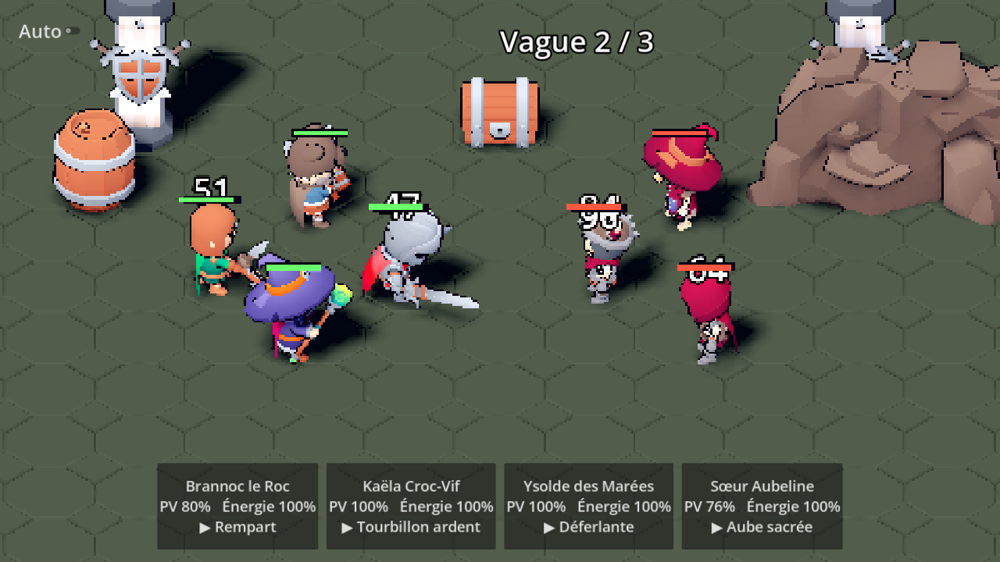

# CREOS — Feuille de route

## ✅ Étape 0 — Fondations (fait)
- [x] Document de design (`docs/GDD.md`)
- [x] Projet Godot 4.7 + packs 3D KayKit (CC0)
- [x] Moteur de combat (jauge de vitesse, énergie, compétences, éléments, boucliers, provocation,
      étourdissement, brûlure/poison) avec tests
- [x] Premier donjon jouable : *Brumenoire — Le Gué des Noyés* (3 vagues + Vel'Zareth la Liche)
- [x] 5 héros de départ en données (`data/heroes.json`)
- [x] Scripts d'installation pour PC (Godot, MCP Godot, MCP Blender)

## 🎯 Étape 1 — Combat qui « claque » (en cours)
- [x] **3 attaques par héros** (`"attacks"` dans le JSON) : ① attaque de base automatique
      (jauge de vitesse), ② attaque à recharge (`"cooldown"` en secondes), ③ ultime (`"energy"`).
      Chaque attaque a son animation (`"anim"`) et son instant d'impact (`"hit_time"`).
- [x] Décor du 1er donjon *Le Gué des Noyés* : île de boue, eau animée, brume, feux follets,
      ruines englouties, torches qui vacillent, clair de lune
- [x] Les héros de corps-à-corps **avancent** vers leur cible pour frapper, puis reviennent
- [x] Projectiles pour les attaques à distance (boule colorée selon l'élément)
- [x] Effets visuels (particules GPU, ondes de choc, éclats sur les modèles) et tremblement de
      caméra sur les coups critiques et les ultimes
- [x] Interface épurée : barres fines au-dessus des têtes (vie + énergie), barre du boss fine,
      vague, Auto et ×2 ; plus de panneau en bas
- [x] Tour par tour : au tour d'un héros, le combat se fige et ses 3 attaques apparaissent en
      petites icônes pixel art (touches 1, 2, 3 au clavier)
- [x] Écran de fin : étoiles (3 = personne n'est tombé, 2 = un héros tombé, 1 sinon), butin,
      bilan par héros
- [x] Sons et musiques (packs CC0 Kenney + OpenGameArt, voir `assets/CREDITS.md`)
- [x] Réglages du son (bouton SON : Général, Musique, Effets, couper), mémorisés ; volumes de
      départ bas, musique qui monte en fondu, sons trop forts atténués
- [x] Équipe de départ remplacée par nos 4 héros chibi (Barbare, Ronin, Alchimiste, Moine),
      chacun avec 7 animations (repos, marche, touché, mort, 3 attaques) et ses effets
      (éclairs, poison, tourbillon, impact au sol)
- [ ] Ajouter un soigneur / soutien (classe Mystique) à la collection

### Brancher un nouveau modèle (ex. `Ronin_Anime.glb`)
1. Copier le `.glb` dans `assets/heroes/` et noter la source dans `assets/CREDITS.md`.
2. Dans `data/heroes.json`, mettre `"model"` vers ce fichier, `"anims"` (repos, course, touché,
   mort) et, pour chaque attaque, `"anim"` = nom exact du clip (ex. `Attack_01_Double_Entaille`)
   et `"hit_time"` = instant de frappe (ex. `0.38`), ou `"hit_times"` pour plusieurs coups.
   `"fx"` choisit l'effet visuel (`vial`, `poison_pool`, `poison_burst`, `lightning_hit`,
   `sky_lightning`, `whirlwind`, `ground_slam`). `"portrait"` règle le cadrage du portrait.
   Ajuster `"scale"` si le modèle est plus grand ou plus petit.
3. Lancer `tests/run_tests.gd` : il vérifie que chaque animation existe dans le modèle.

## 🎯 Étape 2 — Port-Franc et boucle de progression
- [x] Hub **Port-Franc** (scène de démarrage) : place au soleil couchant, maisons en blocs, port,
      Autel des Reliques (cristal), Tour de Morvath au loin, héros qui se promènent ;
      bâtiments cliquables et menus épurés (icônes pixel art), musique de ville
- [x] Table des chasses → combat ; « Retour au port » à la fin du combat
- [x] **Loge des héros** : liste des héros, héros en 3D qui tourne (on peut voir ses 3 attaques),
      stats à son niveau, attaques avec icônes, choix de l'équipe de chasse (4 max)
- [x] **Sire Malgrave** (Chevalier possédé) jouable : chaînes spectrales qui attirent, onde du tombeau
- [x] **Sauvegarde** (`user://save.json`) : or, gemmes, énergie (recharge 1 / 5 min), niveau de la
      loge, niveaux et XP des héros, équipe, butin, meilleures étoiles par donjon
- [x] **Progression** : XP par victoire, niveaux (max 30), stats qui montent avec le niveau ;
      une chasse coûte 6 énergie ; l'écran de fin montre l'XP et les niveaux gagnés
- [ ] Écrans des autres bâtiments (Marché, Autel, Ma loge, Primes…)
- [ ] Carte de la région (Brumenoire : 6 donjons + boss) avec étoiles
- [ ] 10 héros de plus (2 par élément), compétences variées

## Étape 3 — Profondeur
- [ ] Étoiles et éveil des héros (fragments, matériaux)
- [ ] Runes (4 emplacements) et Reliques (1 emplacement, rareté Légendaire ou plus)
- [ ] Corruption des régions + donjons corrompus
- [ ] Forêt de Sylvecroc (animaux géants) : modèles à créer (IA → 3D ou Blender)
- [ ] Familles et bonus d'équipe

## Étape 4 — Nos propres héros (art)
- [ ] Charte graphique (palette, proportions chibi)
- [ ] Pipeline : dessin ou description → image (Higgsfield) → modèle 3D (`generate_3d` ou Hunyuan3D)
      → nettoyage, rig et animations dans Blender (MCP) → `.glb` dans `assets/heroes/`
- [x] Remplacer les modèles KayKit des héros de départ (4 héros chibi)
- [ ] Remplacer les monstres KayKit (squelettes, Liche) par nos modèles

## Étape 5 — En ligne
- [ ] Serveur Nakama (comptes, sauvegarde cloud)
- [ ] Raids de loges (PvP asynchrone : attaquer l'équipe de défense d'un autre joueur)
- [ ] Tour de Morvath + classement
- [ ] Guildes et Bêtes Légendaires

## Étape 6 — Mobile
- [ ] Export Android (Android Studio + SDK, `export_presets.cfg`), test sur téléphone
- [ ] Interface tactile et performances (≥ 30 FPS sur un téléphone moyen)
