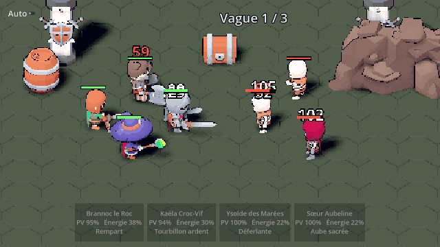
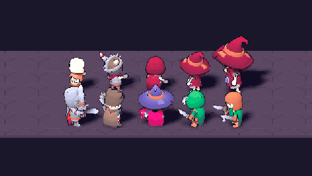

# CREOS — Feuille de route

## ✅ Étape 0 — Fondations (fait)
- [x] Document de design (`docs/GDD.md`)
- [x] Projet Godot 4.7 + packs 3D KayKit (CC0)
- [x] Moteur de combat (jauge de vitesse, énergie, compétences, éléments, boucliers, provocation,
      étourdissement, brûlure/poison) avec tests
- [x] Premier donjon jouable : *Brumenoire — Le Gué des Noyés* (3 vagues + Vel'Zareth la Liche)
- [x] 5 héros de départ en données (`data/heroes.json`)
- [x] Scripts d'installation pour PC (Godot, MCP Godot, MCP Blender)
- [x] Style « 3D low-poly pixel art » (rendu basse résolution, toon, contours, caméra orthographique)
- [x] Vitrine des héros et monstres (`scenes/pixel_showcase.tscn`)

## 🎯 Étape 1 — Combat qui « claque » (prochaine session)
- [ ] Choisir l'équipement visible de chaque héros : les modèles KayKit contiennent déjà toutes
      leurs variantes d'armes et de boucliers (`1H_Sword`, `2H_Sword`, `Round_Shield`…). Ajouter
      `"show": [...]` dans le JSON et masquer le reste. Les armes en plus se mettent sur les os
      `handslot.r` / `handslot.l` (`BoneAttachment3D`).
- [ ] Les héros de corps-à-corps **avancent** vers leur cible pour frapper, puis reviennent
- [ ] Projectiles pour les attaques à distance (flèche, boule magique colorée selon l'élément)
- [ ] Effets visuels de compétence (particules GPU) et petit tremblement de caméra sur les coups critiques
- [ ] Vraie interface : portraits ronds, barre de PV et d'énergie, couleur de l'élément, bouton
      Auto et vitesse ×2
- [ ] Écran de fin : étoiles (0 à 3 selon les héros survivants), butin
- [ ] Sons (packs CC0, par exemple Kenney)

## Étape 1 bis — Style pixel art (affiner)
- [ ] Police pixel (CC0, par exemple de Kenney) pour l'interface et les dégâts
- [ ] Palette de couleurs limitée par région (shader de quantification sur le PixelStage)
- [ ] Éviter le « scintillement » des pixels quand la caméra bouge (caler la caméra sur la grille de pixels)
- [ ] Particules et effets en gros pixels

## Étape 2 — Boucle de progression
- [ ] **Portail d'invocation** (GDD §6 bis) : parchemins, taux, garantie de 10, compteur de pitié,
      bannière de départ, Éclats et Boutique du Chasseur (logique pure + tests des taux)
- [ ] Sauvegarde locale (`user://save.json`) : or, héros possédés, niveaux
- [ ] Niveaux et XP des héros, formule de stats par niveau
- [ ] Carte de la région (Brumenoire : 6 donjons + boss) avec étoiles
- [ ] Écran d'équipe : choisir 4 héros parmi la collection
- [ ] 10 héros de plus (2 par élément), compétences variées

## Étape 3 — Profondeur
- [ ] Étoiles et éveil des héros (fragments, matériaux)
- [ ] Runes (4 emplacements) et Reliques (1 emplacement, rareté Légendaire ou plus)
- [ ] Corruption des régions + donjons corrompus
- [ ] Forêt de Sylvecroc (animaux géants) : modèles à créer (IA → 3D ou Blender)
- [ ] Familles et bonus d'équipe

## Étape 4 — Nos propres héros (art)
- [ ] Charte graphique (palette, proportions chibi)
- [ ] Pipeline : dessin ou description → image (Higgsfield) → modèle 3D (`generate_3d` ou Hunyuan3D)
      → nettoyage, rig et animations dans Blender (MCP) → `.glb` dans `assets/heroes/`
- [ ] Remplacer les 5 modèles KayKit des héros de départ

## Étape 5 — En ligne
- [ ] Serveur Nakama (comptes, sauvegarde cloud)
- [ ] Raids de loges (PvP asynchrone : attaquer l'équipe de défense d'un autre joueur)
- [ ] Tour de Morvath + classement
- [ ] Guildes et Bêtes Légendaires

## Étape 6 — Mobile
- [ ] Export Android (Android Studio + SDK, `export_presets.cfg`), test sur téléphone
- [ ] Interface tactile et performances (≥ 30 FPS sur un téléphone moyen)
